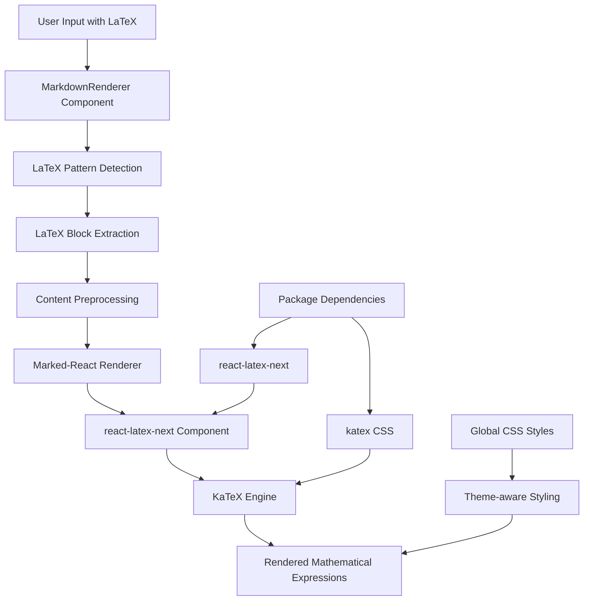

# LaTeX Feature Implementation Guide

This document provides a comprehensive overview of how the LaTeX rendering feature is implemented in the MCP Chatbot application, including detailed code examples and architecture explanations.

## 🏗️ Architecture Overview

The LaTeX feature follows an integrated markdown processing architecture pattern:



## 📁 File Structure

```
src/
├── components/
│   └── markdown.tsx              # Main LaTeX processing logic
├── app/
│   ├── layout.tsx               # Global KaTeX CSS import
│   └── globals.css              # LaTeX theme styling
└── package.json                 # LaTeX dependencies
```

## 🔧 Implementation Details

### 1. Dependencies (`package.json`)

```json
{
  "dependencies": {
    "katex": "^0.16.22", // Core LaTeX rendering engine
    "react-latex-next": "^3.0.0", // React wrapper for KaTeX
    "marked-react": "^3.0.0", // Markdown parser with React support
    "rehype-katex": "^7.0.1", // Alternative LaTeX processor
    "remark-math": "^6.0.0" // Math syntax recognition
  }
}
```

### 2. Global Configuration (`src/app/layout.tsx`)

```typescript
import type { Metadata } from "next";
import { Geist, Geist_Mono } from "next/font/google";
import "katex/dist/katex.min.css"; // Essential KaTeX styles
import "./globals.css";

export default async function RootLayout({
  children,
}: Readonly<{
  children: React.ReactNode;
}>) {
  const locale = await getLocale();

  return (
    <html lang={locale} suppressHydrationWarning>
      <body
        className={`${geistSans.variable} ${geistMono.variable} antialiased`}
      >
        <ThemeProvider
          attribute="class"
          defaultTheme="light"
          themes={["light", "dark"]}
          storageKey="app-theme"
          disableTransitionOnChange
        >
          {/* App content */}
        </ThemeProvider>
      </body>
    </html>
  );
}
```

### 3. Theme-Aware Styling (`src/app/globals.css`)

```css
/* KaTeX styling for theme compatibility */
.katex {
  color: hsl(var(--foreground));
}

.katex-display {
  margin: 1.5rem 0;
  overflow-x: auto;
  overflow-y: hidden;
  padding: 0.5rem;
  border-radius: 0.375rem;
  background-color: hsl(var(--background));
}

.katex-display > .katex {
  white-space: nowrap;
}

.katex .katex-mathml {
  color: hsl(var(--foreground));
}

/* Dark mode adjustments */
@media (prefers-color-scheme: dark) {
  .katex {
    color: hsl(var(--foreground));
  }
}

[data-theme="dark"] .katex {
  color: hsl(var(--foreground));
}
```

### 4. Core LaTeX Processing (`src/components/markdown.tsx`)

#### Import Dependencies

```typescript
import "katex/dist/katex.min.css";
import Latex from "react-latex-next";
import Marked, { ReactRenderer } from "marked-react";
import React, { useMemo } from "react";
```

#### LaTeX Pattern Recognition and Extraction

```typescript
const MarkdownRenderer: React.FC<{ content: string }> = ({ content }) => {
  const [processedContent, extractedCitations, latexBlocks] = useMemo(() => {
    const citations: CitationLink[] = [];

    // LaTeX block storage
    const latexBlocks: Array<{
      id: string;
      content: string;
      isBlock: boolean;
    }> = [];
    let modifiedContent = content;

    // Extract block equations first (display math)
    const blockPatterns = [
      { pattern: /\\\[([\s\S]*?)\\\]/g, isBlock: true },    // \[ ... \]
      { pattern: /\$\$([\s\S]*?)\$\$/g, isBlock: true },    // $$ ... $$
    ];

    blockPatterns.forEach(({ pattern, isBlock }) => {
      modifiedContent = modifiedContent.replace(pattern, (match) => {
        const id = `LATEXBLOCK${latexBlocks.length}END`;
        latexBlocks.push({ id, content: match, isBlock });
        return id;
      });
    });

    // Extract inline equations (inline math)
    const inlinePatterns = [
      { pattern: /\\\(([\s\S]*?)\\\)/g, isBlock: false },   // \( ... \)
      { pattern: /\$(?![{#])[^\$\n]+?\$/g, isBlock: false }, // $ ... $
    ];

    inlinePatterns.forEach(({ pattern, isBlock }) => {
      modifiedContent = modifiedContent.replace(pattern, (match) => {
        const id = `LATEXINLINE${latexBlocks.length}END`;
        latexBlocks.push({ id, content: match, isBlock });
        return id;
      });
    });

    // Continue with citation processing...
    return [modifiedContent, citations, latexBlocks];
  }, [content]);
```

#### Custom Renderer for LaTeX Integration

```typescript
const renderer: Partial<ReactRenderer> = {
  text(text: string) {
    // Check if this text contains any LaTeX placeholders
    const blockPattern = /LATEXBLOCK(\d+)END/g;
    const inlinePattern = /LATEXINLINE(\d+)END/g;

    // If no LaTeX placeholders, return text as-is
    if (!blockPattern.test(text) && !inlinePattern.test(text)) {
      return <WordByWordFadeIn>{text}</WordByWordFadeIn>;
    }

    // Reset regex state
    blockPattern.lastIndex = 0;
    inlinePattern.lastIndex = 0;

    // Process the text to replace placeholders with LaTeX components
    const components: any[] = [];
    let lastEnd = 0;

    // Collect all matches (both block and inline)
    const allMatches: Array<{ match: RegExpExecArray; isBlock: boolean }> = [];

    let match;
    while ((match = blockPattern.exec(text)) !== null) {
      allMatches.push({ match, isBlock: true });
    }

    while ((match = inlinePattern.exec(text)) !== null) {
      allMatches.push({ match, isBlock: false });
    }

    // Sort matches by position
    allMatches.sort((a, b) => a.match.index - b.match.index);

    // Process matches in order
    allMatches.forEach(({ match, isBlock }) => {
      const fullMatch = match[0];
      const start = match.index;

      // Add text before this match
      if (start > lastEnd) {
        const textPart = text.slice(lastEnd, start);
        components.push(
          <WordByWordFadeIn key={`text-${components.length}`}>
            {textPart}
          </WordByWordFadeIn>
        );
      }

      // Find the corresponding LaTeX block
      const latexBlock = latexBlocks.find((block) => block.id === fullMatch);
      if (latexBlock) {
        if (isBlock) {
          // Block math rendering
          components.push(
            <Latex
              key={`latex-${components.length}-${generateKey()}`}
              delimiters={[
                { left: "$$", right: "$$", display: true },
                { left: "\\[", right: "\\]", display: true },
              ]}
              strict={false}
            >
              {latexBlock.content}
            </Latex>
          );
        } else {
          // Inline math rendering
          components.push(
            <Latex
              key={`latex-${components.length}-${generateKey()}`}
              delimiters={[
                { left: "$", right: "$", display: false },
                { left: "\\(", right: "\\)", display: false },
              ]}
              strict={false}
            >
              {latexBlock.content}
            </Latex>
          );
        }
      }

      lastEnd = start + fullMatch.length;
    });

    // Add remaining text
    if (lastEnd < text.length) {
      const remainingText = text.slice(lastEnd);
      components.push(
        <WordByWordFadeIn key={`text-${components.length}`}>
          {remainingText}
        </WordByWordFadeIn>
      );
    }

    return <>{components}</>;
  },

  paragraph(children) {
    // Check if the paragraph contains only a LaTeX block placeholder
    if (typeof children === "string") {
      const blockMatch = children.match(/^LATEXBLOCK(\d+)END$/);
      if (blockMatch) {
        const latexBlock = latexBlocks.find((block) => block.id === children);
        if (latexBlock && latexBlock.isBlock) {
          // Render block equations outside of paragraph tags
          return (
            <div className="my-6 text-center" key={generateKey()}>
              <Latex
                delimiters={[
                  { left: "$$", right: "$$", display: true },
                  { left: "\\[", right: "\\]", display: true },
                ]}
                strict={false}
              >
                {latexBlock.content}
              </Latex>
            </div>
          );
        }
      }
    }

    // Regular paragraph rendering
    return (
      <p className="mb-4 leading-relaxed text-foreground" key={generateKey()}>
        {children}
      </p>
    );
  },

  // Other renderer methods...
};
```

#### Main Component Export

```typescript
const NonMemoizedMarkdown = ({ children }: { children: string }) => {
  return (
    <article className="w-full h-full relative">
      <Marked renderer={renderer}>{children}</Marked>
    </article>
  );
};

export const Markdown = React.memo(NonMemoizedMarkdown);
```

## 🔄 LaTeX Processing Flow

### Step-by-Step Process

1. **Input Processing**

   - User types LaTeX expressions in chat
   - Markdown content contains LaTeX syntax

2. **Pattern Detection**

   - Block patterns: `$$...$$`, `\[...\]`
   - Inline patterns: `$...$`, `\(...\)`

3. **Content Extraction**

   - LaTeX expressions are extracted and stored
   - Placeholders replace original LaTeX in content
   - Citations and other markdown elements are processed

4. **Rendering Pipeline**

   - Marked-React processes the modified content
   - Custom renderer detects LaTeX placeholders
   - `react-latex-next` components render math expressions
   - KaTeX engine generates final mathematical output

5. **Theme Integration**
   - CSS variables ensure theme consistency
   - Dark/light mode compatibility maintained

## 📝 Supported LaTeX Syntax

### Block Math (Display Mode)

```latex
$$
\int_{-\infty}^{\infty} e^{-x^2} dx = \sqrt{\pi}
$$
```

```latex
\[
E = mc^2
\]
```

### Inline Math

```latex
The equation $E = mc^2$ is Einstein's mass-energy equivalence.
```

```latex
We can write \(x = \frac{-b \pm \sqrt{b^2 - 4ac}}{2a}\) for the quadratic formula.
```

### Complex Expressions

```latex
$$
\begin{pmatrix}
a & b \\
c & d
\end{pmatrix}
\begin{pmatrix}
x \\
y
\end{pmatrix}
=
\begin{pmatrix}
ax + by \\
cx + dy
\end{pmatrix}
$$
```

## 🎨 Styling and Theming

### CSS Custom Properties Integration

The LaTeX styling uses CSS custom properties for seamless theme integration:

```css
.katex {
  color: hsl(var(--foreground)); /* Adapts to theme foreground */
}

.katex-display {
  background-color: hsl(var(--background)); /* Adapts to theme background */
  margin: 1.5rem 0;
  padding: 0.5rem;
  border-radius: 0.375rem;
  overflow-x: auto; /* Handles long equations */
}
```

### Responsive Design

- Block equations have horizontal scrolling for overflow
- Inline equations maintain text flow
- Mobile-friendly rendering with appropriate spacing

## 🔧 Configuration Options

### react-latex-next Configuration

```typescript
<Latex
  delimiters={[
    { left: "$$", right: "$$", display: true }, // Block math
    { left: "\\[", right: "\\]", display: true }, // Block math alternative
    { left: "$", right: "$", display: false }, // Inline math
    { left: "\\(", right: "\\)", display: false }, // Inline math alternative
  ]}
  strict={false} // Allows more flexible LaTeX parsing
>
  {latexContent}
</Latex>
```

### KaTeX Options

The implementation uses KaTeX's default configuration with:

- Non-strict mode for better compatibility
- Support for both display and inline math
- Automatic delimiter detection

## 🐛 Error Handling and Fallbacks

### Invalid LaTeX Handling

```typescript
// If LaTeX block is not found, fallback to original text
if (!latexBlock) {
  components.push(
    <WordByWordFadeIn key={`fallback-${components.length}`}>
      {fullMatch}
    </WordByWordFadeIn>
  );
}
```

### Graceful Degradation

- Invalid LaTeX expressions are displayed as plain text
- Parser errors don't break the entire markdown rendering
- Placeholder system ensures content integrity

## 🚀 Performance Optimizations

### Memoization

```typescript
const [processedContent, extractedCitations, latexBlocks] = useMemo(() => {
  // Expensive LaTeX processing only runs when content changes
}, [content]);
```

### Component Memoization

```typescript
export const Markdown = React.memo(NonMemoizedMarkdown);
```

### Efficient Pattern Matching

- Single-pass extraction for all LaTeX patterns
- Placeholder system avoids re-processing
- Sorted match processing for optimal rendering

## 🔍 Troubleshooting

### Common Issues

1. **LaTeX not rendering**

   - Ensure `katex/dist/katex.min.css` is imported
   - Check for syntax errors in LaTeX expressions
   - Verify `react-latex-next` is properly installed

2. **Theme compatibility issues**

   - Ensure CSS custom properties are defined
   - Check dark mode styling rules
   - Verify theme provider is wrapping the app

3. **Performance issues**
   - Large LaTeX expressions may cause rendering delays
   - Consider lazy loading for complex mathematical content
   - Monitor component re-renders with React DevTools
